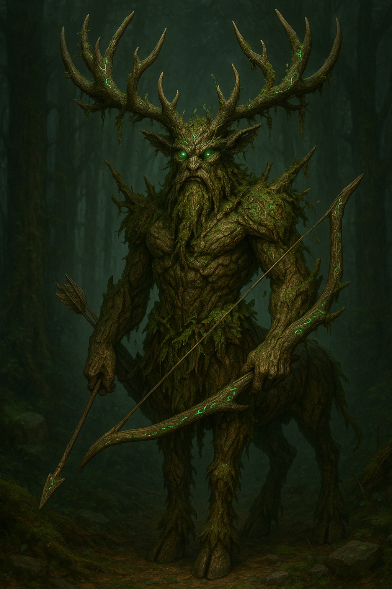

# Wardens of Zyr

**Type:** Primordial Guardian / Humanoid-Beast Hybrid\
**Habitat:** Nythra\
**Rarity:** Legendary (Awakened only in times of grave imbalance)

---

## Overview

**Wardens of Zyr** are the silent sentinels of Nythra, ancient guardians carved from the bark of the **Heartwood** and imbued with the strength of the forest's mightiest stags. Not born, but awakened when the forest senses imbalance or threat, they are the will of **Zyr** made manifest—living embodiments of nature's wrath and wisdom.

---

## Origins

> *"Before time was measured—when no beings with cognitive thought yet wandered the world—Zyr carved guardians from the Heartwood's bark and the strength of the mightiest stags. They lie dormant, waiting for the forest's call."*

- **Created by Zyr:** The first Wardens were carved before sentient life arose, lying dormant within the Heartwood.
- **Awakening:** When Nythra senses danger, corruption, or imbalance, the Heartwood awakens Wardens from their slumber. More can be awakened as the forest's need grows.
- **Purpose:** To guard the Heartwood, preserve the balance between Verdan and Mortis, and purge corruption from Nythra.

---

## Description

### Physical Traits
- **Form:** Elk-centaur lower body, tree-warrior upper body
- **Skin:** Bark-like armor, hardened by centuries of slumber
- **Eyes:** Emerald, burning with Zyr’s will
- **Antlers:** Living conduits of forest magic
- **Blood:** Shimmering sap, linked to the Heartwood. When a Warden falls, its body becomes a grove whose roots reconnect to the Heartwood, returning its energy to Nythra's magical ecosystem.

### Aura
- Moss and fungi feed on their magic, not the other way around.
- Their presence warps the environment: storms form without clouds, time distorts, and illusions lurk in the foliage.

---

## Behavior

### Communication
- **Silent:** Do not speak, but **commune** through:
  - Thoughts carried by wind through leaves
  - Orders transmitted by shifting branches and roots

### Temperament
- **Unrelenting:** Merciless when defending balance, but not evil.
- **Judges:** Even druids fear their judgment.

### Social Structure
- **Solitary:** Each Warden is a force unto itself, but they share a hive-like connection to the Heartwood.

---

## Abilities

### Wild Magic Immunity
- **Connection to Nythra:** Because Wardens are carved from the Heartwood, they possess a direct connection to Nythra, making them immune to the chaotic effects of wild magic.
- **Channeling Power:** The most ancient Wardens have learned to channel wild magic, bending its raw power to their will—a feat impossible for any being without a bond to the forest.

| Ability               | Description                                                                                     |
|-----------------------|-------------------------------------------------------------------------------------------------|
| **Rooting Gaze**      | Can literally root a soul in place.                                                            |
| **Living Weapons**    | Bows and arrows grown from the Warden’s body; arrows sprout into binding roots on impact.      |
| **Magic Hum**         | Bowstrings hum when danger approaches.                                                         |
| **Elemental Grove**   | If a Warden falls, its body becomes a new grove, a permanent scar of magic.                     |
| **Time Distortion**   | Minutes may become days in their presence.                                                     |
| **Wild Magic Absorption** | Flora near them consumes ambient mana from their surroundings—or the flesh of intruders. This effect intensifies in their presence.                                                     |

---

## Ecology

### Role in Nythra
- **Guardians of the Heartwood:** Their primary duty is to defend the tree from those who would exploit or harm it.
- **Balance Keepers:** They cull overgrowth, purge corruption, and ensure neither Verdan nor Mortis dominates.
- **Living Legends:** Few have seen a Warden and lived to tell the tale. To most, they are myths whispered by druids.

### Death and Rebirth
- **No True Death:** When a Warden "falls," its body sinks into the earth, sprouting a new grove. These groves are sacred—and deadly to trespassers.
- **Grove Connection:** The roots of these groves reconnect to the Heartwood through Nythra's vast root network, ensuring the fallen Warden's energy returns to fuel the forest's magical ecosystem.
- **Reawakening:** Some believe fallen Wardens can be reborn if the Heartwood wills it, emerging from their groves when the forest faces its darkest hour.

---

## Lore and Legends

### Cultural Significance
- **Forbidden Guardians:** Most civilizations near Nythra consider the Wardens sacred—and off-limits.
- **Prophecy:**
  > *"When the Heartwood weeps, Zyr will walk among mortals once more. The Wardens will rise, and the world will be remade in balance—or unmade entirely."*

### Notable Encounters
- **The Green-Touched:** Those who return from the forest are forever changed, hearing whispers of the leaves.
- **Ancient Empires:** Some prepare in silence for the Wardens’ final march.

### Quotes
- *"The Wardens do not hunt you. They judge you."*
- *"A Warden’s arrow is not meant to kill—it is meant to bind you to the forest’s will."*

---

## Encounter Information

### Combat Tactics
- **Ambush:** Strike from the tree line, unseen until it’s too late.
- **Psychological Warfare:** Use illusions and time distortion to disorient foes.
- **Binding Roots:** Arrows immobilize targets, allowing the forest to reclaim them.

### Loot
- **Heartwood Sap:** Used in potent potions or rituals.
- **Antler Shards:** Conduits for wild magic, prized by druids and mages.

### Challenge Rating
- **CR:** 20+ (Legendary, near-impossible to defeat without divine intervention)

---

## Related Entities
- [The Heartwood](../../01-geography/landmarks/the_heartwood.md) (Source of their power)
- [Druids of the Green Pact](#) (Those who dare commune with the Wardens)
- [Ancient Empires](#) (Civilizations preparing for the Wardens’ march)

---
**Last Updated:** [Date]
**Author:** [Your Name]
