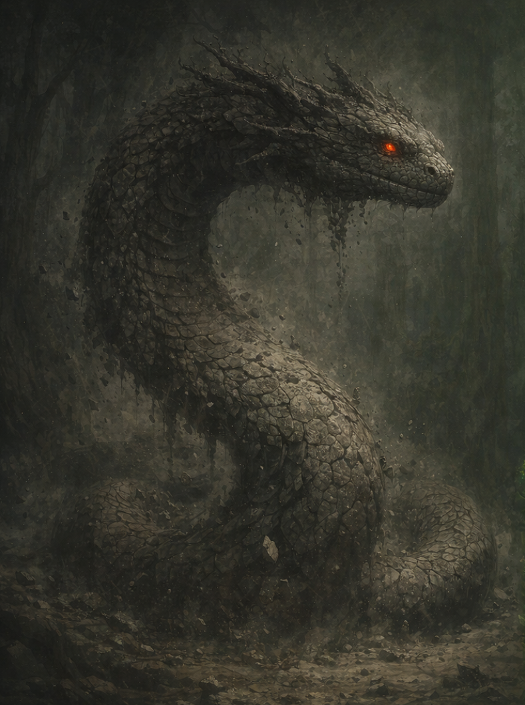

# Morthalas, the Silent End

---

## Overview

| **Field** | **Details** |
|----------|-------------|
| **Title** | Morthalas, the Silent End, The Fading Whisper |
| **Domain** | Decay, Entropy, Death, Rest, The Inevitable End |
| **Symbol** | An ashen serpent coiled around a bare, withered tree |
| **Alignment** | Lawful Neutral (embodies the natural order of endings) |
| **Worshippers** | Undertakers, those seeking peaceful death, scholars of entropy |
| **Sacred Colors** | Ashen gray and deep midnight black |

---

## Origins

> *"I am not cruelty—I am conclusion. Every flame that dims, every mountain that crumbles, every breath that stills—that is not malice. That is me, completing what was begun."*

Morthalas is one of the two primordial entities that existed before the world took its current form. He embodied **Mortis**, the inevitability of decay and entropy that ensures nothing lasts forever.

- **The Age of Silence:** Morthalas drifted through the primordial world as an unstoppable force of conclusion, causing all that grew to wither, all that lived to die, and all that existed to eventually return to stillness and dust.
- **The Eternal Dance:** He opposed Verdaniss ceaselessly, his touch unmaking everything she created in an endless cycle of creation and destruction.
- **The Binding of Balance:** When Zyr emerged to stabilize the world, Morthalas understood the necessity of order. He willingly became Zyr's advisor, representing the essential truth that all things must end so new things may begin.

Now he serves as Zyr's trusted counsel, representing the voice of completion, rest, and the natural cycle of decay. Though his primordial power has been tempered, he remains a colossal serpent whose scales are like ash, whose breath chills to the bone, and whose passing leaves silence in its wake.

---

## Appearance and Manifestations

Morthalas is depicted as:

- A colossal serpent whose ashen gray scales seem to absorb light, patterned with cracks like dried earth, constantly shedding dust and fragments
- Eyes like dying embers—dull red coals that see the end of all things
- A presence so still and silent that sound itself seems to fade in his vicinity

Manifestations in the mortal realm are subtle yet unmistakable:

- Sudden, peaceful deaths of the elderly or sick
- Structures aging decades in moments
- The quiet crumbling of ancient ruins
- A profound silence that brings acceptance and calm
- The scent of autumn leaves and cold stone

---

## Domains and Influence

### Decay
Morthalas's influence manifests through:

- The natural decomposition that returns all things to soil
- The weathering of mountains and erosion of stone
- The aging process in all living creatures
- The breakdown of what no longer serves

### Entropy
He embodies the universal law of decline:

- The cooling of stars and fires
- The dissolution of order into chaos
- The slow unwinding of all complex systems
- The inevitable march toward stillness

### Death
His power ensures completion through:

- The peaceful passing of those whose time has come
- The mercy of ending suffering
- The transition from life to whatever lies beyond
- The necessary clearing that allows new life to emerge

---

## Worship and Rituals

### Followers
Morthalas is revered by:

- **Undertakers and keepers of the dead** who honor proper endings
- The elderly seeking peaceful passage
- **Scholars of entropy** studying the nature of endings
- Those grieving who need acceptance of loss
- Philosophers contemplating mortality

### Sacred Sites

| Location | Significance |
|---------|--------------|
| **The Ashen Coil** | Ancient ruins where Morthalas is said to rest between counsel—pilgrims leave memories of the dead |
| **The Silent Pools** | Still waters that reflect only gray sky, used for meditation on mortality |
| **The Dust Gardens** | A place where nothing grows, yet mourners find peace and acceptance |

### Rituals

- **Rite of Final Rest:** Funeral ceremony invoking Morthalas to guide the dead peacefully
- **The Offering of Ash:** Burning mementos of the deceased and offering the ashes to the wind
- **Meditation on Endings:** Silent vigils contemplating mortality and accepting impermanence
- **The Letting Go:** Ritual release of grief, acknowledging that all things must end

---

## Legends and Prophecies

### The Deathless Fool
A legend tells of a sorcerer who sought immortality and succeeded through dark magic. But Morthalas appeared, not in anger but in sorrow, showing the mage a vision of the universe: all his loved ones dying, civilizations crumbling, stars burning out, until he floated alone in eternal darkness. The sorcerer begged for death. Morthalas granted it as a mercy, teaching that death is not punishment but release.

### The Final Silence

> *"When the last tree withers, and the Heartwood's roots turn to dust,  
> The Silent End shall spread his coils across the world,  
> And all will return to the stillness from which it came—unless Verdaniss consents to withdraw."*

This prophecy mirrors Verdaniss's, suggesting that Morthalas could end all life but chooses not to, honoring his role in balance.

---

## Morthalas's Relationship with Mortals

Morthalas acts through gentle inevitability:

- Blessings: peaceful deaths, acceptance of loss, freedom from suffering
- Punishments: not punishment—merely the natural consequence of all things ending
- Direct action: appears only to those who truly need release or understanding of mortality

Those who fear him **suffer more than those who accept him**.

---

## Symbols and Omens

| Symbol or Omen | Meaning |
|----------------|--------|
| Ashen serpent coiled around dead wood | Morthalas's presence—a death approaches |
| Sudden stillness and silence | His attention has been drawn to someone's ending |
| Dust falling in patterns like scales | A sacred site or blessed location |
| The scent of cold stone and autumn | He is near, bringing acceptance |
| Things aging rapidly | Warning of imbalance—too much decay |

---

## Divine Powers and Abilities

### Granted Powers
Morthalas can bestow upon devoted followers:

- **Peaceful Passage:** The ability to ease pain and grant merciful deaths
- **Entropy's Touch:** The power to age or decay objects rapidly
- **Acceptance:** Immunity to fear of death and the ability to calm the dying

### Divine Artifacts
- **The Ashen Scale:** A single scale from Morthalas that crumbles but never fully disappears—grants the bearer the ability to see when death approaches
- **Dust of the Coil:** Sacred ash that, when scattered over the dying, grants them visions of peace and acceptance

---

## Relationships with Other Deities

### Allies
- **Zyr:** His master and the one who gave his destructive nature purpose—he serves with solemn dedication

### Rivals
- **Verdaniss:** His eternal counterpart—they oppose each other by nature, yet balance requires both

### Complex Relationship
Though Morthalas and Verdaniss represent opposing forces, they have developed a profound understanding through eons. In Zyr's presence, they speak rarely but meaningfully, each acknowledging the other's necessity. Some say they are not enemies but two halves of a greater whole.

---

## Clergy and Champions

### Priesthood
- **Structure:** Somber orders of death-priests who guide funerary rites and offer counsel on mortality
- **Duties:** Ease the dying, perform last rites, maintain graveyards, teach acceptance of endings
- **Selection:** Often those who have faced death and found peace rather than fear

### Divine Champions
- **Ashwardens:** Paladins who protect the sanctity of death and prevent undeath or false immortality
- **Powers Granted:** Immunity to fear, ability to destroy undead, power to grant peaceful deaths
- **Sacred Duty:** Ensure all things end properly and that the cycle is not perverted

---

## Holy Days and Festivals

| Festival | Description |
|---------|-------------|
| **The Day of Stillness** | Autumn equinox observance honoring the dead with silent meditation |
| **The Final Breath** | Winter solstice—the longest night, celebrating rest and endings |
| **Remembrance of Dust** | Spring ritual acknowledging that decay makes room for new growth |

---

## Tenets and Commandments

1. Death is not evil—it is natural and necessary
2. All things must end so new things may begin
3. Face mortality with acceptance, not fear
4. Grant mercy to those who suffer without hope
5. Do not pervert the cycle through undeath or false immortality
6. Honor the dead, but do not cling to them
7. In endings, find peace

---

## Myths and Stories

### The Serpent's Gift
A warrior lay dying on a battlefield, crying out against the injustice of her death. Morthalas appeared, coiling around her, and showed her a vision: her death would inspire her comrades to win the battle, her sacrifice would save thousands, and her name would be remembered for generations. She smiled, accepted her end, and passed peacefully. Morthalas taught that even in death, there is meaning.

### The Pact of Balance
When Zyr first established the Heartwood, both Verdaniss and Morthalas were asked to merge their essences with it. Verdaniss agreed eagerly, but Morthalas hesitated—his nature was to end things, not sustain them. Zyr explained that the Heartwood would eventually die too, and when that day came, Morthalas's purpose would be fulfilled. Understanding this, Morthalas coiled around the tree opposite Verdaniss, and their combined power made the Heartwood eternal—until it isn't.

---

## Related Entities

- [Zyr, the Creator God of Balance](./zyr.md) — his master and the keeper of equilibrium
- [Verdaniss, the Ever-Living Coil](./verdaniss.md) — his eternal counterpart and fellow advisor
- [The Heartwood](../../01-geography/landmarks/the_heartwood.md) — contains his essence along with Verdaniss's
- [Wardens of Zyr](../../02-creatures-and-races/beasts/warden.md) — guardians blessed by both serpents

---

**Last Updated:** December 10, 2025  
**Author:** MaxSmeets
