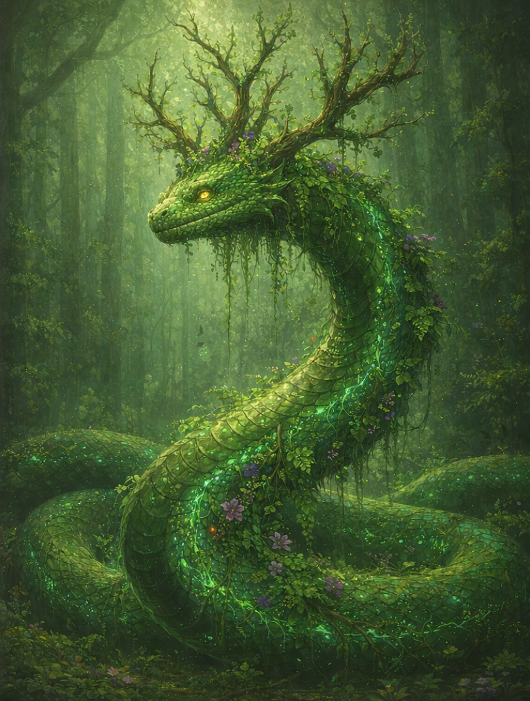

# Verdaniss, the Ever-Living Coil

---

## Overview

| **Field** | **Details** |
|----------|-------------|
| **Title** | Verdaniss, the Ever-Living Coil, The Eternal Bloom |
| **Domain** | Growth, Vitality, Abundance, Unchecked Life |
| **Symbol** | A coiled serpent adorned with blooming vines and flowers |
| **Alignment** | Chaotic Good (embodies wild, untamed growth) |
| **Worshippers** | Farmers, healers, those seeking fertility and renewal |
| **Sacred Colors** | Vibrant emerald green and golden yellow |

---

## Origins

> *"Before Zyr brought balance, I was the pulse of creation—endless, unstoppable, eternal. Every seed that burst from soil, every heartbeat that quickened with life—that was my song."*

Verdaniss is one of the two primordial entities that existed before the world took its current form. She embodied **Verdan**, the raw essence of unchecked growth and vitality that knew no limits or restraint.

- **The Age of Chaos:** Verdaniss roamed the primordial world as a force of infinite creation, causing forests to spring forth in moments, creatures to multiply without end, and life to flourish so wildly that it threatened to consume everything.
- **The Eternal Dance:** She clashed endlessly with Morthalas, her counterpart of decay, in a cosmic struggle that nearly tore existence apart.
- **The Binding of Balance:** When Zyr emerged to stabilize the world, Verdaniss recognized the wisdom in equilibrium. She willingly became Zyr's advisor, channeling her endless vitality through the framework of balance rather than chaos.

Now she serves as Zyr's trusted counsel, representing the voice of growth, renewal, and the persistent drive of life to continue. Though diminished from her primordial power, she remains a colossal serpent whose scales shimmer with living chlorophyll, whose breath causes flowers to bloom, and whose passage leaves trails of fertile soil.

---

## Appearance and Manifestations

Verdaniss is depicted as:

- A colossal serpent whose vibrant emerald scales pulse with bioluminescent patterns, adorned with living vines, flowers, and moss that grow directly from her body
- Eyes that glow with the golden light of spring sunlight
- A crown of antlers that branch like ancient trees, constantly sprouting new growth

Manifestations in the mortal realm are subtle yet unmistakable:

- Impossible blooms appearing overnight in barren lands
- Wounds healing with supernatural speed
- A surge of vitality in dying ecosystems
- The sound of rustling leaves and growing roots where none should be

---

## Domains and Influence

### Growth
Verdaniss's influence manifests through:

- Rapid plant growth and bountiful harvests
- Accelerated healing and regeneration
- The spread of forests and wild places
- The multiplication of life in all its forms

### Vitality
She embodies the relentless persistence of life:

- Creatures resisting death longer than natural
- Ecosystems recovering from devastation
- The surge of energy during spring and renewal
- The will to survive against impossible odds

### Abundance
Her power ensures plenty through:

- Fertile soil and rich harvests
- Thriving wildlife populations
- Waters teeming with life
- The overflow of natural resources

---

## Worship and Rituals

### Followers
Verdaniss is revered by:

- **Farmers and agriculturalists** seeking bountiful yields
- Healers who invoke her regenerative power
- **Midwives and those celebrating birth**
- Druids who honor wild growth (though carefully, mindful of Zyr's balance)

### Sacred Sites

| Location | Significance |
|---------|--------------|
| **The Serpent's Garden** | A hidden grove where plants grow at visible speed—pilgrims plant seeds as offerings |
| **The Coiling Springs** | Natural hot springs said to have healing properties from Verdaniss's passing |
| **The Verdant Scar** | A canyon where life grows so thick it threatens to overflow—a reminder of her primordial chaos |

### Rituals

- **Rite of First Bloom:** Spring ceremony where followers plant seeds while invoking Verdaniss's blessing for growth
- **The Living Offering:**献 献 献 献 献 献 献 献ring living plants rather than cut flowers, symbolizing continuous life
- **Healing Circle:** Communal ritual where the sick are surrounded by growing things and prayers to Verdaniss

---

## Legends and Prophecies

### The Overgrowing
Long ago, a desperate village prayed to Verdaniss directly, bypassing Zyr's balance. Their crops grew beyond measure—but so did the weeds, the pests, the disease. Within a season, their fields were an impenetrable jungle, and they starved amid plenty. Zyr intervened, teaching that even abundance requires restraint.

### The Whisper of Spring

> *"When winter refuses to release its grip, and the world grows cold and still,  
> The Ever-Living Coil shall stir from her counsel,  
> And with one breath, bring spring eternal—unless Morthalas consents to withdraw."*

This prophecy suggests that Verdaniss could force eternal spring, but chooses not to, honoring her role in balance.

---

## Verdaniss's Relationship with Mortals

Verdaniss acts through subtle encouragement:

- Blessings: enhanced fertility, bountiful harvests, miraculous healing
- Punishments: unchecked growth that overwhelms (as a lesson in balance)
- Direct action: rarely intervenes directly, but her essence flows through the Heartwood to those who need renewal

Those who pray to her without acknowledging balance **may receive more than they can handle**.

---

## Symbols and Omens

| Symbol or Omen | Meaning |
|----------------|--------|
| Coiled serpent with blooming vines | Verdaniss's presence and blessing |
| Flowers blooming out of season | Her favor or a sign of imbalance |
| The scent of spring rain in winter | Her attention has been drawn |
| Serpent scales that shimmer green | A sacred site or blessed location |
| Rapid, uncontrollable growth | Warning that balance is threatened |

---

## Divine Powers and Abilities

### Granted Powers
Verdaniss can bestow upon devoted followers:

- **Regeneration:** Enhanced healing and recovery from injury
- **Green Touch:** The ability to encourage plant growth through touch
- **Vitality Surge:** Temporary bursts of superhuman endurance and strength

### Divine Artifacts
- **The Living Scale:** A single scale from Verdaniss that never stops growing moss and vines—grants the bearer immunity to poison and disease
- **Seed of the Coil:** A seed that, when planted, grows into a tree that produces fruit with healing properties

---

## Relationships with Other Deities

### Allies
- **Zyr:** Her master and the one who gave her purpose within balance—she serves willingly and with deep respect

### Rivals
- **Morthalas:** Her eternal counterpart—they oppose each other by nature, yet neither can exist without the other

### Complex Relationship
Though Verdaniss and Morthalas represent opposing forces, they have developed a strange respect through eons. They understand each other in ways no other beings can, and both serve Zyr's greater vision.

---

## Clergy and Champions

### Priesthood
- **Structure:** Informal circles of druids and healers who honor both Verdaniss and Zyr
- **Duties:** Encourage growth while maintaining balance, heal the sick, bless crops
- **Selection:** Often chosen through dreams or visions of the serpent

### Divine Champions
- **Bloomwardens:** Druids who channel Verdaniss's power to protect wild places from decay
- **Powers Granted:** Accelerated plant growth, enhanced healing magic, resistance to disease
- **Sacred Duty:** Nurture life while honoring Zyr's balance

---

## Holy Days and Festivals

| Festival | Description |
|---------|-------------|
| **The First Green** | Spring equinox celebration honoring Verdaniss's return from winter slumber |
| **Harvest Gratitude** | Autumn festival thanking Verdaniss for abundance while acknowledging the coming rest |
| **The Coiling Dance** | Midsummer ritual where followers dance in spiral patterns, mimicking Verdaniss's form |

---

## Tenets and Commandments

1. Life is sacred—nurture it wherever possible
2. Growth must serve the greater balance—unchecked abundance leads to ruin
3. Death is not the enemy—it makes room for new life
4. Share abundance with those in need
5. Respect the cycle—spring follows winter, and both have their place

---

## Myths and Stories

### The First Heartwood Bloom
It is said that when Zyr first nurtured the Heartwood sapling, Verdaniss coiled around its trunk and breathed life into its roots. Her essence merged with the tree, giving it the power to anchor life itself. To this day, the Heartwood blooms with flowers that match her scales.

### The Serpent's Mercy
A tale tells of a hunter who mortally wounded a doe. As he approached his kill, Verdaniss appeared and offered him a choice: take the deer's life, or spare it and receive her blessing. The hunter chose mercy. The doe rose, healed, and bounded away. From that day, the hunter could heal wounds with a touch—but never again could he take a life.

---

## Related Entities

- [Zyr, the Creator God of Balance](./zyr.md) — her master and the keeper of equilibrium
- [Morthalas, the Silent End](./morthalas.md) — her eternal counterpart and fellow advisor
- [The Heartwood](../../01-geography/landmarks/the_heartwood.md) — contains her essence along with Morthalas's
- [Wardens of Zyr](../../02-creatures-and-races/beasts/warden.md) — guardians blessed by both serpents

---

**Last Updated:** December 10, 2025  
**Author:** MaxSmeets
