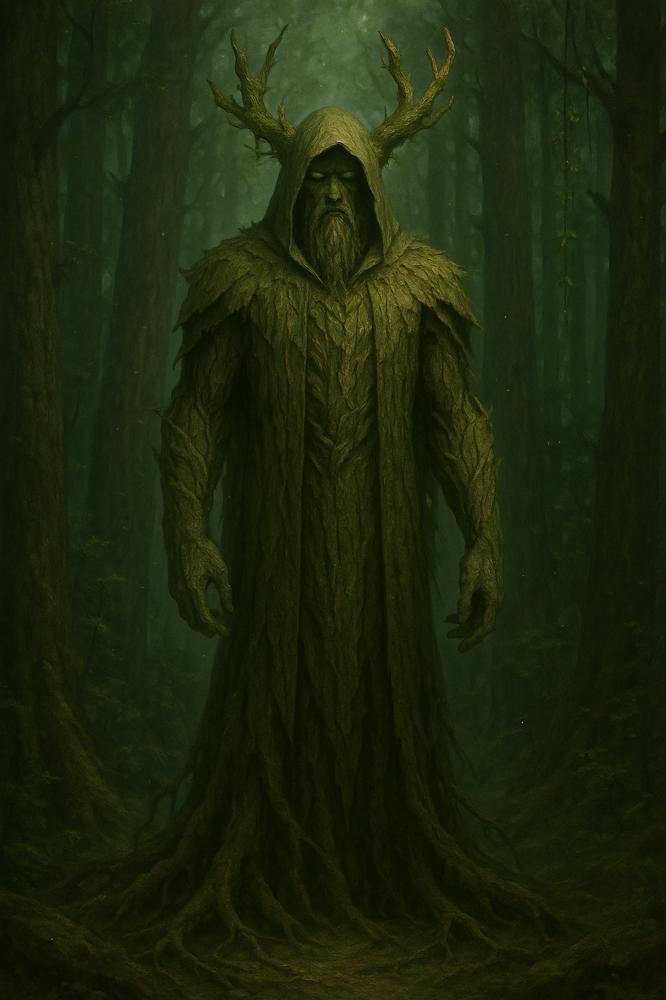

# Zyr, the Creator God of Balance

---

## Overview

| **Field** | **Details** |
|----------|-------------|
| **Title** | Zyr, the Creator God of Balance |
| **Domain** | Balance, Creation, Wild Magic, Life and Decay |
| **Symbol** | A pair of intertwined branches—one blooming, one withered |
| **Alignment** | True Neutral (embodies equilibrium) |
| **Worshippers** | Druids, philosophers, Wardens of Zyr, and those who seek harmony |
| **Sacred Colors** | Emerald green and deep amber |

---

## Origins

> *"Before time was measured—before beings with cognitive thought wandered the world—there was only the clash of Verdan and Mortis—wild, untamed life and the creeping stillness of decay. From their chaos, Zyr emerged, not to conquer, but to balance."*

Zyr is the primordial deity who shaped the world from the violent collision of two fundamental forces:

- **Verdan** — the essence of unchecked growth and vitality.  
- **Mortis** — the inevitability of decay and entropy.

When the forces of life and decay threatened to tear the newborn world apart, Zyr intervened, actively taking on the responsibility as the divine keeper of balance. During his exploration of this chaotic realm, he discovered a sapling touched by both Verdan and Mortis—a tree with the potential to anchor the warring forces. Zyr nurtured this sapling into the **Heartwood**, the living nexus of balance at the center of **Nythra**.

From the Heartwood's bark and the strength of Nythra's mightiest stags, Zyr carved the first **Wardens**—guardians who would lie dormant within the tree, awakening when the forest sensed danger. More Wardens can be awakened as needed to maintain the balance.

Unlike gods who favor one force over the other, Zyr exists to ensure neither dominates. The world, in Zyr's design, is a delicate scale—one that must never tip too far.

---

## Appearance and Manifestations

Zyr does not take a single form but is often depicted as:

- A towering hooded figure rooted into Nythra's soil. Often depicted with hands pressed to the Heartwood's exposed roots.
- Two colossal serpents—one vibrant and the other ashen and still. While not a direct manifestation of Zyr, these refer to Zyr's most trusted advisors which are mostly unknown to the common folk.

Manifestations in the mortal realm are subtle yet unmistakable:

- Sudden blooming in barren soil
- A cleansing storm without destruction
- The awakening of a **Warden of Zyr**

---

## Domains and Influence

### Balance  
Zyr's influence ensures harmony through:

- Seasonal cycles
- Predator-prey dynamics
- The rise and fall of civilizations  
- The very balance between life and death

### Creation  
Zyr shapes existence rather than **making from nothing**. The Heartwood (found and nurtured), the Wardens, and wild magic are extensions of Zyr's stabilizing will.

### Wild Magic  
Raw and uncontrollable to any entity without a direct connection to Nythra. Those who attempt mastery without such a bond are often consumed or driven mad. However, beings directly tied to the Heartwood—such as the Wardens—are immune to wild magic's chaotic nature. The most ancient Wardens have even learned to channel these powers.

---

## Worship and Rituals

### Followers
Zyr is revered by:

- **Druids of the Green Pact**
- Philosophers and seekers of harmony
- **Wardens of Zyr**, silent instruments of balance
- Hermits attuned to nature’s rhythms

### Sacred Sites

| Location | Significance |
|---------|--------------|
| **The Heartwood** | The center of Zyr's presence in Nythra — pilgrims offer paired opposites (water & stone, seed & ash). |
| **The Grove of Whispers** | Wind carries Zyr's will to those who listen. |
| **The Ashen Vale** | Life and death coexist in perfect equilibrium. |

### Rituals

- **Rite of Equilibrium:** Meditations during solstices, burning a cherished item to signify acceptance of loss.
- **Offering of Duality:** Two equal and opposite items left at the Heartwood.
- **Vigil of Stillness:** Remaining motionless for hours to embody unyielding balance.

---

## Legends and Prophecies

### The Sundering  
A kingdom once tried to harness the Heartwood for immortality. The land rose and buried them — a warning etched into history.

### The Final Prophecy

> *"When the scales of the world snap, and the Heartwood weeps sap like tears,  
> Zyr will walk among mortals once more.  
> The Wardens will rise, and the world will be remade in balance—or unmade entirely."*

Some call it doom. Others — renewal.

---

## Zyr’s Relationship with Mortals

Zyr acts through the world, not favors:

- Blessings: subtle, timely, lifesaving
- Punishments: inevitable consequences of imbalance
- Direct action: carried out by **Wardens of Zyr**

Those who disrupt harmony **face nature’s wrath**.

---

## Symbols and Omens

| Symbol or Omen | Meaning |
|----------------|--------|
| Intertwined branches | Unity of life and decay |
| A scale with a leaf and bone | The balance Zyr enforces |
| A silent stag | Presence of the Wardens |
| Sudden unnatural storms | Warning of imbalance |
| A tree blooming in winter | Zyr’s favor — or a test to come |

---

## Related Entities

- [The Heartwood](../../01-geography/landmarks/the_heartwood.md) — the physical anchor of Zyr’s will  
- [Wardens of Zyr](../../02-creatures-and-races/beasts/warden.md) — divine protectors, awaken only when necessary  
- **Druids of the Green Pact** — interpreters and stewards of balance  

---

**Last Updated:** \[Date\]  
**Author:** \[Your Name\]
